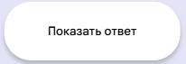
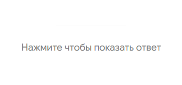
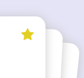

# Проект QUIZ
Игра в слова по карточкам. Если пользователь приложения знает слово, то он продолжает игру до тех пор пока слова не кончились или пока у него имеется интерес.

## Функционал приложения
 
<b>Кнопка "Далее"</b> 
При нажатии на кнопку происходит подгрузка новых слов. Как только переключение доходит до допустимого предела (3 слова), то происходит подгрузка новых слов также в количестве 3-х  
 
<b>Кнопка "Показать ответ"</b> 
Показывает перевод на игровой карточке  
<i>Также имеется непосредственно такая же кнопка и на самой карточке</i> 
 
 
 
<b>Кнопка "Перемешать"</b> 
Производит перемешивание слов (колоды). Теперь ты точно не угадаешь какое слово следующее)  

 
<b>Кнопка "Добавить в избранное"</b> 
Если пользователю не дается слово или наоборот он не хочет забыть его, то он может добавить его в избранное  

 
<b>Кнопка "Список избранных слов"</b> 
Отображает список ваших избранных слов. В этом списке пока можно только просматривать и удалять слова.
Если пользователь не выбрал ни одного слова, то этого меню не будет на странице 

## Стек приложения
- <b>State manager</b> - Zustand
- <b>Client</b> - React + Typescript
- <b>Bundler</b> - Vite
- <b>Test</b> - Vitest
- <b>Style</b> - styled-components + react-icons

## <i>!!! Примечание к тестам !!!</i>
Может отваливаться тест перемешивания карт, так как 